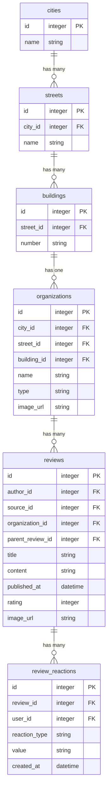

# ERD диграмма

# Описание ERD

Данная модель данных отражает структуру базы данных, предназначенной для хранения информации о географических объектах, организациях, отзывах пользователей и их реакциях. Она включает в себя набор логически связанных сущностей, обеспечивающих целостность, согласованность и удобство работы с данными.

## Сущности и связи

### 1. **Города (`cities`)**

Содержит информацию о городах.  
**Поля:**

- `id` — уникальный идентификатор города.
- `name` — наименование города.

Каждый город может содержать множество улиц.

---

### 2. **Улицы (`streets`)**

Хранит данные об улицах.  
**Поля:**

- `id` — уникальный идентификатор улицы.
- `city_id` — ссылка на идентификатор города.
- `name` — наименование улицы.

Улица принадлежит одному городу. Название улицы должно быть уникальным в рамках одного города.

---

### 3. **Здания (`buildings`)**

Содержит информацию о зданиях.  
**Поля:**

- `id` — уникальный идентификатор здания.
- `street_id` — ссылка на идентификатор улицы.
- `number` — номер здания.

Здание связано с конкретной улицей. Номер здания должен быть уникальным на одной улице.

---

### 4. **Организации (`organizations`)**

Хранит данные о компаниях или заведениях.  
**Поля:**

- `id` — уникальный идентификатор организации (UUID).
- `name` — наименование организации.
- `city_id` — ссылка на город (опционально).
- `type` — тип организации.
- `address` — адрес.
- `image_url` — ссылка на изображение (опционально).

Организация может быть связана с городом, улицей и зданием через внешние ключи.

---

### 5. **Отзывы (`reviews`)**

Содержит пользовательские отзывы об организациях.  
**Поля:**

- `id` — уникальный идентификатор отзыва.
- `author` — автор отзыва.
- `source` — источник отзыва.
- `organization_id` — ссылка на организацию.
- `title` — заголовок отзыва.
- `text` — текст отзыва.
- `published_at` — дата публикации.
- `rating` — рейтинг.
- `image_url` — ссылка на изображение (опционально).
- `parent_review_id` — ссылка на родительский отзыв (реализует древовидную структуру комментариев).

Отзыв привязан к одной организации. Возможно наличие цепочки ответов на отзыв через поле `parent_review_id`.

---

### 6. **Реакции на отзывы (`review_reactions`)**

Хранит пользовательские реакции на отзывы.  
**Поля:**

- `id` — уникальный идентификатор реакции.
- `review_id` — ссылка на отзыв.
- `user_id` — идентификатор пользователя.
- `reaction_type` — тип реакции.
- `value` — значение реакции.
- `created_at` — дата создания.

Реакция уникальна по комбинации: отзыв, пользователь, тип реакции и её значение. При удалении отзыва автоматически удаляются все связанные с ним реакции.
