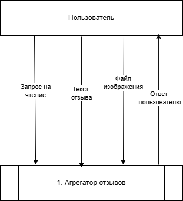

# Описания DFD-диаграмм 0 и 1 уровня

---

## Описание DFD-диаграммы 0 уровня (общая структура системы):

---

### 1. Основные компоненты системы:  
1. Пользователь  
   - Инициирует действия:  
     - Отправка запросов на просмотр данных  
     - Загрузка отзывов и изображений  

2. Агрегатор отзывов  
   - Центральный процесс, обрабатывающий следующие запросы:  
     - Приём и обработка запросов пользователя
     - Формирование ответов (например, вывод отзывов, подтверждение загрузки)

---

### 2. Потоки данных:  
- Пользователь → Агрегатор:  
  - Запрос на чтение 
  - Текст отзыва
  - Файл изображения

- Агрегатор → Пользователь:  
  - Ответ пользователю (список отзывов, подтверждение успешной операции и т.д.)  

---

### 3. Общая логика работы системы:  
1. Запрос пользователя:  
   - Пользователь отправляет запрос  
2. Обработка агрегатором:  
   - Агрегатор принимает данные, обрабатывает запрос и формирует ответ  
3. Возврат результата:  
   - Пользователь получает отформатированный ответ

## Описание DFD-диаграммы 1 уровня для документации

---

### 1. Основные компоненты системы:  
1. Пользователь  
   - Взаимодействует с системой через процессы:  
     - Отправка запросов (просмотр данных, регистрация, аутентификация)
     - Загрузка отзывов и изображений

2. Процессы системы:  
   - Процесс получения и выборки данных:  
     - Обрабатывает запросы на чтение  
     - Выполняет фильтрацию и сортировку данных  
   - Процесс работы с отзывами (только если пользователь зарегистрирован):  
     - Сохраняет/редактирует отзывы в базе данных  
     - Генерирует статусы операций (успех/ошибка)  
   - Процесс загрузки файлов (только если пользователь зарегистрирован):  
     - Передает файлы в Cloud Storage  
     - Формирует URL-ссылки на загруженные файлы  
   - Процесс аутентификации:  
     - Проверяет логин/пароль пользователя  
     - Управляет сессиями (создание/закрытие)  
   - Процесс регистрации:  
     - Проверяет уникальность данных (логин, email) 
     - Сохраняет данные в Firebase  

3. Хранилища данных:  
   - База данных:  
     - Хранит информацию об организациях и отзывах
   - Cloud Storage Server:  
     - Хранит изображения
   - Firebase:  
     - Хранит логины, пароли и сессионные ключи

---

### 2. Потоки данных:  
#### **Регистрация**:  
- **Пользователь → Процесс регистрации**:  
  - Регистрационные данные 
- **Процесс регистрации → Firebase**:  
  - Данные для проверки уникальности  
- **Firebase → Процесс регистрации**:  
  - Результат сохранения 
- **Процесс регистрации → Пользователь**:  
  - Статус регистрации  

---

#### **Аутентификация**:  
- **Пользователь → Процесс аутентификации**:  
  - Логин, пароль 
- **Процесс аутентификации → Firebase**:  
  - Данные для проверки  
- **Firebase → Процесс аутентификации**:  
  - Результат 
- **Процесс аутентификации → Пользователь**:  
  - Сессия пользователя/ошибка аутентификации  

---

#### **Получение и выборка данных**:  
- **Пользователь → Процесс получения данных**:  
  - Запрос на просмотр данных   
- **Процесс получения данных → База данных**:  
  - Условия отбора 
- **База данных → Процесс получения данных**:  
  - Результат отбора
- **Процесс получения данных → Пользователь**:  
  - Ответ клиенту

---

#### **Работа с отзывами (только для зарегистрированных пользователей)**:  
- **Пользователь → Процесс работы с отзывами**:  
  - Отзыв
- **Процесс работы с отзывами → База данных**:  
  - Данные отзыва
- **База данных → Процесс работы с отзывами**:  
  - Результат сохранения
- **Процесс работы с отзывами → Пользователь**:  
  - Статус сохранения 

---

#### **Загрузка файлов (только для зарегистрированных пользователей)**:  
- **Пользователь → Процесс загрузки файлов**:  
  - Файл изображения  
- **Процесс загрузки файлов → Cloud Storage Server**:  
  - Содержимое файла
- **Cloud Storage Server → Процесс загрузки файлов**:  
  - URL файла  
- **Процесс загрузки файлов → База данных**:  
  - Ссылка на изображение
- **Процесс загрузки файлов → Пользователь**:  
  - Подтверждение загрузки/ошибка
  
---

### 3. Общая логика работы системы:  
1. Регистрация/аутентификация:  
   - Пользователь предоставляет данные (логин, пароль)  
   - Система проверяет уникальность данных при регистрации или подтверждает их при аутентификации через Firebase. 
2. Работа с отзывами:  
   - Пользователь отправляет текст и/или файл 
   - Агрегатор сохраняет текст в базу данных, файл — в Cloud Storage  
   - Формируется URL-ссылка на файл и возвращается пользователю  
3. Просмотр данных:  
   - Пользователь задает критерии отбора (например, организация, дата)  
   - Система фильтрует данные из базы и выводит результат  

