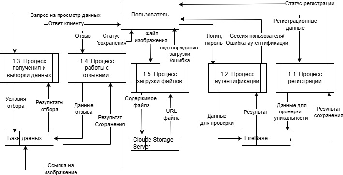

# Описания DFD-диаграмм 0 и 1 уровня

---

## Описание DFD-диаграммы 0 уровня (общая структура системы):

---

### 1. Основные компоненты системы:
1. Пользователь  
   - Взаимодействует с системой через агрегатор отзывов.  
   - Выполняет действия:  
     - Создание/редактирование отзывов.  
     - Чтение информации (отзывы, данные организаций).  
     - Загрузка и отдача файлов (например, изображений).

2. Агрегатор отзывов  
   - Центральный процесс, координирующий работу системы.  
   - Обрабатывает запросы пользователя:  
     - Сохраняет отзывы в базу данных.  
     - Читает данные из базы для вывода информации пользователю.  
     - Передает файлы между пользователем и Cloud Storage.

3. База данных  
   - Хранит структурированные данные:  
     - Текстовые отзывы.  
     - Метаданные (ID пользователей, организации, даты).  
     - Ссылки на файлы в Cloud Storage.

4. Cloud Storage  
   - Хранилище неструктурированных данных (файлы, изображения).  
   - Получает файлы от пользователя через агрегатор.  
   - Отдает файлы пользователю по запросу.

---

### 2. Потоки данных:
- Между пользователем и агрегатором:  
  - Создание/чтение отзывов: текстовые данные от пользователя → агрегатор → база данных.  
  - Вывод информации: данные из базы → агрегатор → пользователь.  
  - Загрузка/отдача файлов: файлы от пользователя → агрегатор → Cloud Storage (и наоборот).

- Между агрегатором и базой данных:  
  - Чтение данных: агрегатор запрашивает информацию из базы для ответа пользователю.  
  - Запись данных: агрегатор сохраняет новые отзывы или изменения в базу.

- Между агрегатором и Cloud Storage:  
  - Передача файлов: агрегатор передает загруженные файлы в Cloud Storage и получает их по запросу пользователя.

---

### 3. Общая логика работы системы:
1. Пользовательский запрос:  
   - Пользователь отправляет действие (например, "добавить отзыв с фото").  
2. Обработка агрегатором:  
   - Агрегатор разбивает запрос на части:  
     - Сохраняет текст отзыва в базу данных.  
     - Передает файл в Cloud Storage.  
3. Возврат результата:  
   - После обработки агрегатор возвращает подтверждение пользователю (например, отформатированный отзыв с ссылкой на фото).

---

### 4. Особенности модели:
- Упрощённая структура: Диаграмма 0 уровня не отражает детали (например, регистрацию, аутентификацию), фокусируясь на основном потоке данных.  
- Роль агрегатора: Является "сердцем" системы, координируя взаимодействие всех компонентов.  
- Разделение данных:  
  - База данных хранит структурированную информацию (текст, метаданные).  
  - Cloud Storage — неструктурированные файлы (изображения, документы).

## Описание DFD-диаграммы 1 уровня для документации

---

### 1. Основные компоненты системы:
1. Пользователь  
   - Взаимодействует с системой через запросы и ввод данных.  
   - Может быть гостем (без авторизации) или  зарегистированным (после входа).  

2. Процессы:  
   - Процесс получения данных: Запрашивает информацию об организации из базы данных.  
   - Процесс загрузки файлов: Сохраняет изображения в Cloud Storage и записывает ссылки в базу данных.  
   - Процесс выборки отзывов (гость): Формирует список отзывов для неавторизованных пользователей.  
   - Процесс работы с отзывами (зарегистрирован): Позволяет оставлять/редактировать отзывы только авторизованным пользователям.  
   - Процесс аутентификации: Проверяет логин и пароль пользователя.  
   - Процесс регистрации: Сохраняет данные нового пользователя в базу.  

3. Хранилища данных:  
   - База данных организаций: Хранит информацию об организациях.  
   - База данных отзывов: Содержит текстовые отзывы и ссылки на изображения.  
   - База данных пользователей: Сохраняет данные зарегистрированных пользователей (логин, пароль, email).  

4. Cloud Storage Server: Хранит загруженные изображения.

---

### 2. Потоки данных:
#### Аутентификация и регистрация:
- Регистрация:  
  - Пользователь → Процесс регистрации: Ввод данных (логин, пароль, email).  
  - Процесс регистрации → База данных пользователей: Сохранение в БД.  
  - База данных пользователей → Процесс регистрации: Статус регистрации (успех/ошибка).  
  - Процесс регистрации → Пользователь: Подтверждение/Ошибка регистрации.  

- Аутентификация:  
  - Пользователь → Процесс аутентификации: Ввод логина и пароля.  
  - Процесс аутентификации → База данных пользователей: Проверка данных.  
  - База данных пользователей → Процесс аутентификации: Результат проверки.  
  - Процесс аутентификации → Пользователь: Сессия пользователя (если успех) или Ошибка аутентификации (если неудача).

#### Работа с отзывами:
- Гость:  
  - Пользователь → Процесс выборки отзывов (гость): Получение списка отзывов.  
  - Процесс выборки отзывов (гость) → База данных отзывов: Чтение из БД.  
  - База данных отзывов → Процесс выборки отзывов (гость): Возврат отзывов.  
  - Процесс выборки отзывов (гость) → Пользователь: Ответ клиенту (список отзывов).  

- Зарегистрированный пользователь:  
  - Пользователь → Процесс работы с отзывами: Загрузка изображений + Текст отзыва.  
  - Процесс работы с отзывами → Процесс загрузки файлов: Загрузка изображений.  
  - Процесс загрузки файлов → Cloud Storage Server: Сохранение в Cloud.  
  - Cloud Storage Server → Процесс загрузки файлов: URL файла.  
  - Процесс загрузки файлов → База данных отзывов: Сохранение ссылки в БД.  
  - Процесс работы с отзывами → База данных отзывов: Чтение/Сохранение отзывов.  
  - База данных отзывов → Процесс работы с отзывами: Возврат отзывов.  
  - Процесс работы с отзывами → Пользователь: Ответ клиенту (подтверждение публикации отзыва).

#### Просмотр организации:
- Пользователь → Процесс получения данных: Запрос на просмотр организации.  
- Процесс получения данных → База данных организаций: Чтение из БД.  
- База данных организаций → Процесс получения данных: Возврат данных.  
- Процесс получения данных → Пользователь: Ответ клиенту (информация об организации).

---

### 3. Особенности модели:
- Разделение прав доступа:  
  - Гости могут только просматривать отзывы и информацию об организации.  
  - Регистрированные пользователи могут оставлять отзывы и загружать изображения.  

- Интеграция с Cloud Storage:  
  - Изображения хранятся отдельно от текстовых данных, что улучшает производительность и масштабируемость.  

- Логическая связь данных:  
  - Каждый отзыв привязан к пользователю (через ID) и может содержать ссылку на изображение в Cloud Storage.

---
