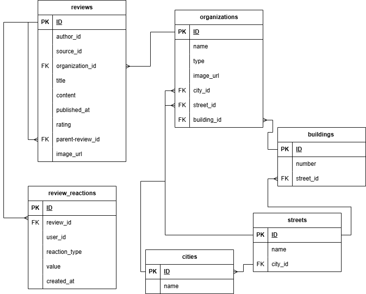

# ERD диаграмма

## Диграмма

## Описание ERD

Данная модель данных отражает структуру базы данных, предназначенной для хранения информации о географических объектах, организациях, отзывах пользователей и их реакциях. Она включает в себя набор логически связанных сущностей, обеспечивающих целостность, согласованность и удобство работы с данными.

### Сущности и связи

#### 1. Города (`cities`)

Содержит информацию о городах.  
Поля:

- `id` — уникальный идентификатор города.
- `name` — наименование города.

Каждый город может содержать множество улиц.

---

#### 2. Улицы (`streets`)

Хранит данные об улицах.  
Поля:

- `id` — уникальный идентификатор улицы.
- `city_id` — ссылка на идентификатор города.
- `name` — наименование улицы.

Улица принадлежит одному городу. Название улицы должно быть уникальным в рамках одного города.

---

#### 3. Здания (`buildings`)

Содержит информацию о зданиях.  
Поля:

- `id` — уникальный идентификатор здания.
- `street_id` — ссылка на идентификатор улицы.
- `number` — номер здания.

Здание связано с конкретной улицей. Номер здания должен быть уникальным на одной улице.

---

#### 4. Организации (`organizations`)

Хранит данные о компаниях или заведениях.  
Поля:

- `id` — уникальный идентификатор организации (UUID).
- `name` — наименование организации.
- `type` — тип организации. (enum: RESTAURANTS_AND_CAFES, CINEMA_AND_CONCERTS, PARKS_AND_MUSEUMS, SHOPPING_AND_STORES, HOTELS_AND_HOSTELS)
- `image_url` — ссылка на изображение.
- `city_id` — ссылка на город.
- `street_id` — ссылка на улицу.
- `building_id` — ссылка на здание.

Организация может быть связана с городом, улицей и зданием через внешние ключи.

---

#### 5. Отзывы (`reviews`)

Содержит пользовательские отзывы об организациях.  
Поля:

- `id` — уникальный идентификатор отзыва.
- `author_id` — автор отзыва. (Идентификатор пользователя, полученный от Firebase (x-user-uid  (он же localId)), преобразуется с помощью алгоритма md5. Полученный md5-хеш далее используется для создания UUID. )
- `source_id` — источник отзыва.  источник отзыва (имеется H2 база данных в external service example, которую можно модифицировать и сохранять на диск (как в cloud server)).
- `organization_id` — ссылка на организацию.
- `title` — заголовок отзыва.
- `content` — текст отзыва.
- `published_at` — дата публикации.
- `rating` — рейтинг.
- `parent_review_id` — ссылка на родительский отзыв (реализует древовидную структуру комментариев).
- `image_url` — ссылка на изображение (опционально).

Отзыв привязан к одной организации. Возможно наличие цепочки ответов на отзыв через поле parent_review_id.
Ограничение MVP:
На этапе MVP каждый отзыв (Review) содержит только один атрибут image_url: 1 отзыв = 1 изображение.

План развития:
В дальнейшем потребуется внести небольшие изменения в проект для увеличения возможности использование нескольких изображений в отзыве
---

#### 6. Реакции на отзывы (`review_reactions`)

Хранит пользовательские реакции на отзывы.  
Поля:

- `id` — уникальный идентификатор реакции.
- `review_id` — ссылка на отзыв.
- `user_id` — идентификатор пользователя (UUID на основе md5-хеша идентификатора Firebase).
- `reaction_type` — тип реакции. (enum: LIKE, DISLIKE, EMOJI).
- `value` — значение реакции.
- `created_at` — дата создания.

Реакция уникальна по комбинации: отзыв, пользователь, тип реакции и её значение. При удалении отзыва автоматически удаляются все связанные с ним реакции.