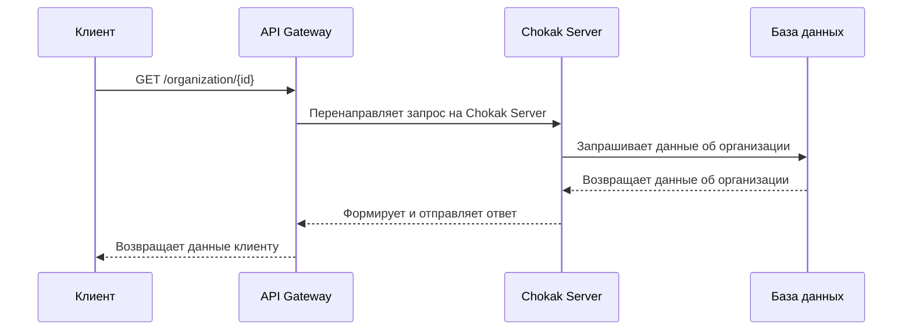
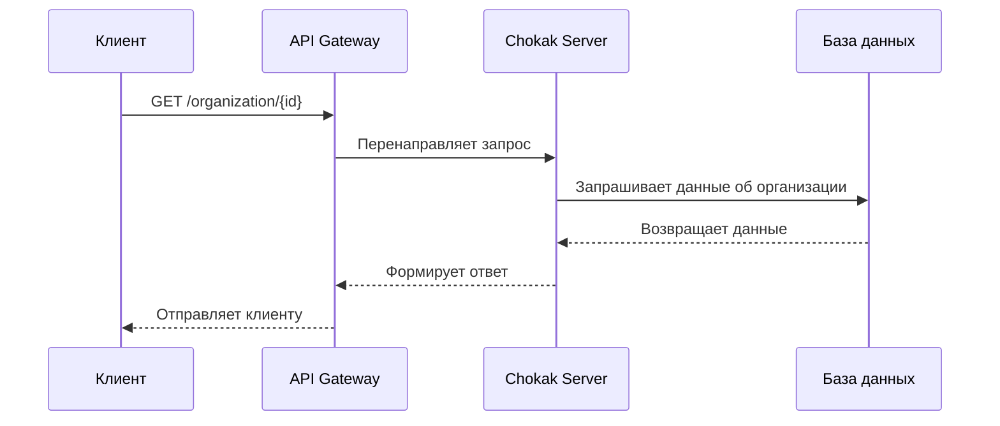

# Архитектура проекта

[[TOC]]

## 1. Общее описание

Система представляет собой **веб-агрегатор отзывов о компаниях**, где пользователи могут:

- Искать организации;
- Читать и публиковать отзывы;
- Оценивать компании по различным критериям.

Система состоит из нескольких серверов, каждый из которых выполняет свою роль в обеспечении функциональности, безопасности и масштабируемости приложения.

---

## 2. Основные компоненты системы

### 2.1. Основной сервер (Chokak-Server)

**Назначение:**  

Обеспечивает выполнение основной бизнес-логики:

- Обработка запросов от клиентов.
- Взаимодействие с базой данных.
- Логика аутентификации и авторизации.
- Управление отзывами, рейтингом, пользователями и организациями.

**Основные функции:

- Получает запросы от гейтвея или напрямую от клиента.
- Выполняет проверку прав доступа.
- Обращается к БД за данными.
- Формирует ответы в формате JSON.

### 2.2. Гейтвей (Chokak-Gateway-Server)

**Назначение:**

Единая точка входа для всех внешних запросов. 

**Отвечает за:**

- Роутинг запросов к нужному сервису.
- Аутентификацию.

**Преимущества:**

- Защита внутренних сервисов от прямого доступа.
- Единая точка контроля и маршрутизации.

### 2.3. Сервер хранения данных (Chokak-Cloud-Storage)
**Назначение:**  
Хранение медиафайлов (например, фотографии организаций и отзывов).

**Используется для:**

- Загрузки и выдачи файлов.
- Обеспечения отказоустойчивости и масштабируемости хранения.

**Основные функции:**
- Приём файлов от Main Server по REST API.
- Сохранение файлов локально с уникальным именем.
- Генерация URL для доступа к загруженному файлу.
- Удаление файлов по запросу.
- Проверка прав доступа при удалении (через заголовок `X-User-Uid`).

---

### 3. Взаимодействие компонентов

#### Сценарий: Получение информации об организации

1. Клиент отправляет запрос через API Gateway.
2. Гейтвей перенаправляет запрос на Chokak Server.
3. Chokak Server запрашивает данные из БД.
4. БД возвращает информацию об организации.
5. Chokak Server формирует ответ и отправляет его обратно через гейтвей клиенту.

#### Сценарий: Получение списка отзывов по организации

1. Клиент отправляет GET-запрос с идентификатором организации через гейтвей.
2. Гейтвей направляет запрос на Chokak Server.
3. Chokak Server делает выборку отзывов из БД по ID организации.
4. Chokak Server формирует структурированный список отзывов.
5. Ответ отправляется клиенту через гейтвей.

